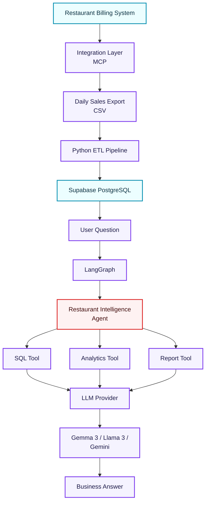

# 🍋 Zomato Orders — AI Business Analyst Dashboard

An agentic AI business analyst designed to ingest daily restaurant transaction records from a simulated billing system, clean and load them into a relational database, and dynamically query the data to answer complex business questions in natural language.

---

## 📐 System Architecture

This project implements the following custom data flow and multi-agent pipeline:



### Flow Walkthrough
1. **Billing Data Simulation**: The MCP server interfaces with a local SQLite database (`zomato.db`) containing raw transaction records (1.1+ million rows).
2. **Integration Layer (MCP)**: Requests a date-specific export (e.g. `2017-10-04`), returning raw order data saved under `daily_exports/`.
3. **Data Engineer (ETL)**: Formats data types, strips trailing characters (like `\n`), standardizes currency, and batch upserts clean orders to a target cloud **Supabase PostgreSQL** database.
4. **Agent Orchestration (LangGraph)**:
   - **Planner Agent**: Looks up the target schema and generates a raw PostgreSQL query to answer the user's question.
   - **Business Analyst Agent**: Safely executes the generated SQL against Supabase via a custom `execute_sql` database function, interprets the rows returned, and outputs a clean markdown report.

---

## 📂 Directory Structure

```text
ZomatoOrders/
├── agent-starter/
│   ├── graph.py                # LangGraph agents definition
│   └── requirements.txt        # Backend dependencies
├── data/
│   └── zomato_data.zip         # Raw Zomato CSV dataset zip
├── daily_exports/              # Generated daily sales reports CSVs
├── mcp_server/
│   ├── server.py               # Local FastMCP billing simulation server
│   └── requirements.txt        # Server dependencies
├── setup.py                    # One-time script: unzips data and builds SQLite database
├── streamlit_app.py            # Streamlit Dashboard User Interface
├── .env                        # Environment Configuration (Git Ignored)
└── README.md                   # Project documentation
```

---

## ⚡ Quick Start

### 1. Repository Setup & DB Build
Extract the raw Zomato dataset and compile the source SQLite database:
```bash
python setup.py
```

### 2. Configure Environment Variables
Copy `.env.example` to `.env` and fill in your Supabase credentials and LLM keys:
```env
SUPABASE_URL=https://your-project-id.supabase.co
SUPABASE_KEY=your-supabase-service-role-key

# Set your model provider: 'gemini' | 'groq' | 'openai' | 'ollama'
LLM_PROVIDER=gemini

GEMINI_API_KEY=your_gemini_api_key
GROQ_API_KEY=your_groq_api_key
OPENAI_API_KEY=your_openai_api_key
```

### 3. Create Supabase Helper Functions
Run the schema setup script in the **Supabase SQL Editor** to construct the tables, and create the SQL executor function:
```sql
CREATE OR REPLACE FUNCTION execute_sql(sql_query TEXT)
RETURNS JSONB
LANGUAGE plpgsql
SECURITY DEFINER
AS $$
DECLARE
    result JSONB;
BEGIN
    EXECUTE 'SELECT COALESCE(jsonb_agg(t), ''[]''::jsonb) FROM (' || sql_query || ') t' INTO result;
    RETURN result;
EXCEPTION WHEN OTHERS THEN
    RETURN jsonb_build_object('error', SQLERRM);
END;
$$;
```

### 4. Start the MCP Server
Launch the local Billing simulation server:
```bash
cd mcp_server
pip install -r requirements.txt
python server.py
```

### 5. Launch the Streamlit Dashboard UI
Start the interactive frontend panel in a new terminal window:
```bash
pip install -r agent-starter/requirements.txt
streamlit run streamlit_app.py
```

---

## 💡 Multi-LLM Provider Support

This project is built to run on various cloud and local LLM backends:
- **Google Gemini**: Uses `gemini-3.5-flash` via AI Studio API key.
- **Groq Cloud**: Uses `llama-3.3-70b-versatile` via Groq Console API key.
- **Ollama**: Allows running offline using a local `gemma2:9b` model to protect local computing resources.
